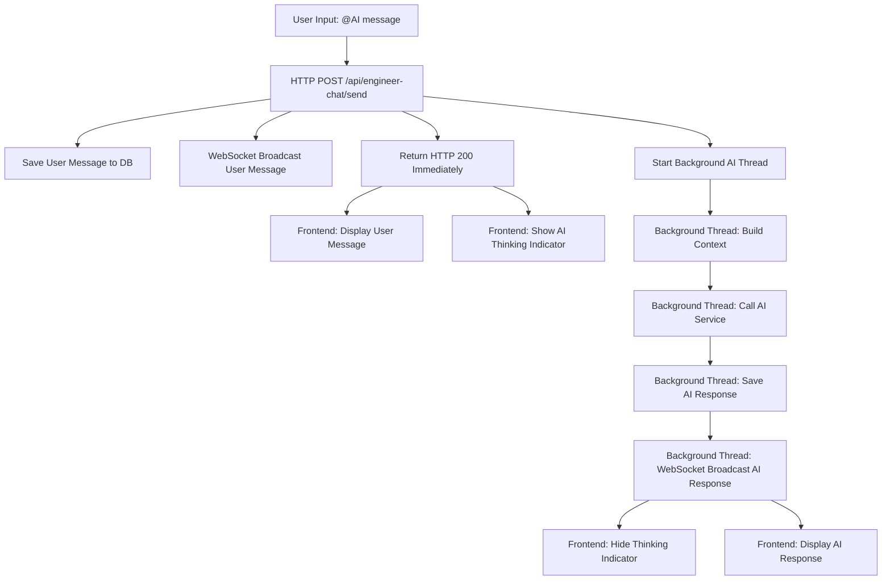
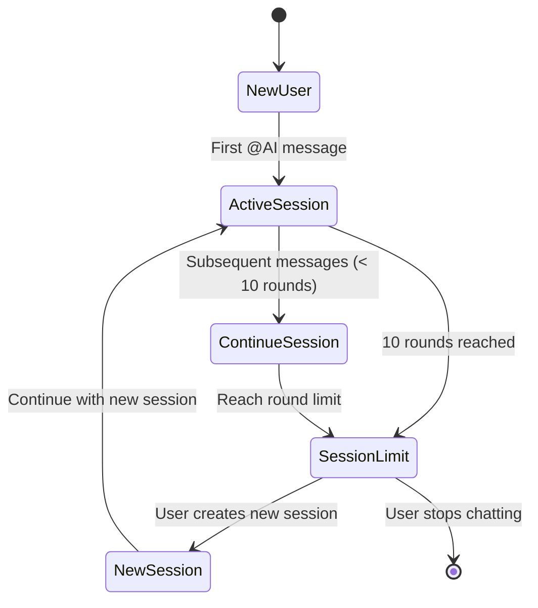

# Engineer Chat System Architecture

## Overview

The Engineer Chat System is a real-time AI assistant designed to help security engineers during incident response. It provides instant, context-aware assistance while maintaining complete isolation from the automated multi-agent workflows.

## Design Principles

### 1. Asynchronous Processing
- **Immediate User Feedback**: API responses in ~10ms, not 5-10 seconds
- **Background AI Processing**: Non-blocking AI service calls in separate threads
- **Real-time Updates**: WebSocket communication for live message delivery

### 2. System Isolation
- **Independent Operation**: Zero interference with agent-to-agent communication
- **Separate Context**: Builds conversation context from event summaries, not agent states
- **Unified Storage**: Uses the same Message table but with distinct categorization

### 3. Modern User Experience
- **Instant Response**: Buttons and inputs remain responsive during AI processing
- **Visual Feedback**: Clear status indicators and animations
- **Continuous Flow**: Users can send multiple messages without waiting

## Technical Architecture

### Data Flow Diagram



### Component Architecture

#### Backend Components

```
┌─────────────────────────────────────────────────────────────┐
│                     Engineer Chat System                    │
├─────────────────────────────────────────────────────────────┤
│                                                             │
│  ┌─────────────────┐    ┌──────────────────────────────┐    │
│  │ engineer_chat_  │    │   engineer_chat_controller   │    │
│  │     api.py      │◄──►│          .py                 │    │
│  │                 │    │                              │    │
│  │ • JWT Auth      │    │ • Session Management         │    │
│  │ • Request Val.  │    │ • Context Building           │    │
│  │ • Response      │    │ • Async AI Processing        │    │
│  │   Formatting    │    │ • WebSocket Broadcasting     │    │
│  └─────────────────┘    └──────────────────────────────┘    │
│                                                             │
├─────────────────────────────────────────────────────────────┤
│                    Shared Infrastructure                    │
├─────────────────────────────────────────────────────────────┤
│                                                             │
│  ┌─────────────────┐    ┌──────────────────────────────┐    │
│  │   Message       │    │     WebSocket Controller     │    │
│  │   Model         │◄──►│                              │    │
│  │                 │    │ • Real-time Broadcasting     │    │
│  │ • Unified Table │    │ • Event Room Management      │    │
│  │ • Agent + Chat  │    │ • Connection Handling        │    │
│  │   Categories    │    │                              │    │
│  └─────────────────┘    └──────────────────────────────┘    │
│                                                             │
└─────────────────────────────────────────────────────────────┘
```

#### Frontend Components

```
┌─────────────────────────────────────────────────────────────┐
│                    Frontend Integration                     │
├─────────────────────────────────────────────────────────────┤
│                                                             │
│  ┌─────────────────┐    ┌──────────────────────────────┐    │
│  │   warroom.js    │    │       warroom.css            │    │
│  │                 │    │                              │    │
│  │ • @AI Detection │    │ • Engineer Chat Styling      │    │
│  │ • Async API     │    │ • AI Thinking Animation      │    │
│  │   Calls         │    │ • Message Distinction        │    │
│  │ • WebSocket     │    │ • Visual Feedback States     │    │
│  │   Handling      │    │                              │    │
│  │ • UI State      │    │                              │    │
│  │   Management    │    │                              │    │
│  └─────────────────┘    └──────────────────────────────┘    │
│                                                             │
├─────────────────────────────────────────────────────────────┤
│                    warroom.html Template                    │
├─────────────────────────────────────────────────────────────┤
│                                                             │
│  • Input field with @AI placeholder guidance               │
│  • Message container for real-time updates                 │
│  • WebSocket connection initialization                     │
│                                                             │
└─────────────────────────────────────────────────────────────┘
```

## Database Schema Design

### Message Table Extensions

```sql
CREATE TABLE messages (
    -- Existing fields
    id INT PRIMARY KEY AUTO_INCREMENT,
    message_id VARCHAR(255) UNIQUE,
    event_id VARCHAR(255),
    user_id VARCHAR(255),
    message_from VARCHAR(255),
    message_content JSON,
    message_type VARCHAR(255),
    round_id INT,
    created_at TIMESTAMP,
    updated_at TIMESTAMP,
    
    -- Engineer Chat Extensions
    message_category VARCHAR(32) DEFAULT 'agent',
    chat_session_id VARCHAR(64),
    sender_type VARCHAR(32),
    event_summary_version VARCHAR(64),
    
    -- Indexes for performance
    INDEX idx_message_category (message_category),
    INDEX idx_chat_session (chat_session_id),
    INDEX idx_sender_type (sender_type),
    INDEX idx_event_summary (event_summary_version)
);
```

### Message Categories

#### Agent Messages (`message_category = 'agent'`)
```json
{
    "message_from": "_captain|_manager|_operator|_executor|_expert",
    "message_type": "llm_request|task_assignment|command_result|...",
    "sender_type": null,
    "chat_session_id": null
}
```

#### Engineer Chat Messages (`message_category = 'engineer_chat'`)
```json
{
    "message_from": "user_id|ai_assistant|system",
    "message_type": "chat|thinking|error",
    "sender_type": "user|ai|system",
    "chat_session_id": "chat_abc123_def456"
}
```

## Session Management

### Session Lifecycle



### Session ID Generation

```python
def generate_session_id(event_id, user_id):
    """Generate unique session ID with length constraint"""
    import hashlib
    import uuid
    
    # Create deterministic hash for uniqueness
    combined = f"{event_id}_{user_id}"
    hash_suffix = hashlib.md5(combined.encode()).hexdigest()[:8]
    uuid_suffix = uuid.uuid4().hex[:8]
    
    # Format: chat_{hash}_{uuid} (max 64 chars)
    return f"chat_{hash_suffix}_{uuid_suffix}"
```

## Performance Optimizations

### Response Time Benchmarks

| Operation | Target Time | Implementation |
|-----------|-------------|----------------|
| API Response | < 50ms | Immediate return after saving user message |
| User Message Display | < 100ms | WebSocket broadcast from API |
| AI Processing | 3-5 seconds | Background thread with progress indicator |
| AI Response Display | < 200ms | WebSocket broadcast from background thread |

### Threading Model

```python
# Main Thread (HTTP Request)
def send_message():
    # 1. Validate and save user message (~5ms)
    user_message = save_user_message()
    
    # 2. Broadcast user message (~2ms)
    websocket_broadcast(user_message)
    
    # 3. Start background processing (~1ms)
    threading.Thread(
        target=process_ai_response,
        args=(context_data,),
        daemon=True
    ).start()
    
    # 4. Return immediately (~1ms)
    return {"status": "success", "ai_processing": True}

# Background Thread (AI Processing)
def process_ai_response(context_data):
    # 1. Build conversation context (~500ms)
    context = build_context(context_data)
    
    # 2. Call AI service (~3-4 seconds)
    ai_response = call_ai_service(context)
    
    # 3. Save and broadcast AI response (~200ms)
    ai_message = save_ai_message(ai_response)
    websocket_broadcast(ai_message)
```

### Memory Management

- **Daemon Threads**: Background AI processing threads are marked as daemon to prevent hanging on app shutdown
- **Context Limiting**: Conversation history limited to last 20 messages to control memory usage
- **Session Cleanup**: Automatic cleanup of old sessions and expired message data

## Error Handling Strategy

### Graceful Degradation

```python
def handle_ai_service_failure(error, session_id):
    """Handle AI service failures gracefully"""
    error_message = {
        "content": f"AI助手暂时无法回复，请稍后重试。错误: {str(error)}",
        "message_type": "error",
        "sender_type": "system"
    }
    
    # Save error message to maintain conversation flow
    save_message(error_message, session_id)
    
    # Broadcast error to user
    websocket_broadcast(error_message)
```

### Error Recovery Mechanisms

1. **Service Timeout**: 30-second timeout for AI service calls
2. **Retry Logic**: Single retry attempt for transient failures
3. **Fallback Responses**: Generic helpful messages when AI is unavailable
4. **Error Logging**: Comprehensive logging for debugging and monitoring

## Security Considerations

### Authentication & Authorization

```python
@jwt_required()
def send_message():
    # 1. Verify JWT token
    current_user = get_jwt_identity()
    
    # 2. Validate user permissions
    user = User.query.filter_by(username=current_user).first()
    if not user or not user.is_active:
        return unauthorized_response()
    
    # 3. Validate event access
    event = Event.query.filter_by(event_id=event_id).first()
    if not event:
        return not_found_response()
```

### Session Isolation

- **User-specific Sessions**: Users can only access their own chat sessions
- **Event-scoped Context**: Conversation context limited to specific security events
- **No Cross-contamination**: Engineer chat context completely separate from agent workflows

### Data Protection

- **Audit Trail**: All engineer chat messages logged with timestamps and user attribution
- **Content Filtering**: AI responses reviewed and logged for security compliance
- **Session Encryption**: WebSocket communications use secure connections

## Monitoring & Observability

### Key Metrics

```python
# Performance Metrics
response_time_histogram = {
    "api_response": "< 50ms",
    "user_message_display": "< 100ms", 
    "ai_response_generation": "3-5 seconds",
    "ai_response_display": "< 200ms"
}

# Usage Metrics
usage_counters = {
    "total_sessions": "counter",
    "messages_per_session": "histogram",
    "ai_service_calls": "counter",
    "ai_service_failures": "counter"
}

# Quality Metrics
quality_metrics = {
    "user_satisfaction": "manual_feedback",
    "conversation_completion_rate": "percentage",
    "session_abandonment_rate": "percentage"
}
```

### Logging Strategy

```python
import logging

# Structured logging for engineer chat events
logger = logging.getLogger('engineer_chat')

def log_conversation_event(event_type, session_id, user_id, **kwargs):
    """Structured logging for conversation events"""
    logger.info(
        f"EngineerChat.{event_type}",
        extra={
            "session_id": session_id,
            "user_id": user_id,
            "timestamp": datetime.utcnow().isoformat(),
            **kwargs
        }
    )
```

## Testing Strategy

### Unit Tests

```python
# test_engineer_chat_controller.py
class TestEngineerChatController:
    def test_async_message_processing(self):
        """Test that AI processing doesn't block main thread"""
        
    def test_session_management(self):
        """Test session creation and round limiting"""
        
    def test_context_building(self):
        """Test conversation context construction"""
        
    def test_error_handling(self):
        """Test graceful handling of AI service failures"""
```

### Integration Tests

```python
# test_engineer_chat_api.py
class TestEngineerChatAPI:
    def test_end_to_end_conversation(self):
        """Test complete conversation flow from frontend to AI response"""
        
    def test_websocket_broadcasting(self):
        """Test real-time message delivery"""
        
    def test_authentication_flow(self):
        """Test JWT authentication and session isolation"""
```

### Performance Tests

```bash
# Load testing with realistic scenarios
artillery run engineer_chat_load_test.yml

# WebSocket stress testing
wscat -c ws://localhost:5007/socket.io/ --execute load_test.js
```

## Deployment Considerations

### Environment Configuration

```bash
# .env additions for engineer chat
ENGINEER_CHAT_MAX_ROUNDS=10
ENGINEER_CHAT_AI_TIMEOUT=30
ENGINEER_CHAT_SESSION_CLEANUP_INTERVAL=3600
ENGINEER_CHAT_CONTEXT_HISTORY_LIMIT=20
```

### Production Monitoring

- **Health Checks**: Monitor AI service availability and response times
- **Resource Usage**: Track thread pool usage and memory consumption
- **User Experience**: Monitor conversation completion rates and user feedback

### Scalability Planning

- **Horizontal Scaling**: Background AI processing can be moved to separate worker processes
- **Caching**: Session context and event summaries can be cached for improved performance
- **Database Optimization**: Consider message table partitioning for high-volume deployments

## Future Enhancements

### Planned Features

1. **Multi-language Support**: Internationalization for global security teams
2. **Voice Integration**: Speech-to-text and text-to-speech capabilities
3. **Advanced Analytics**: Conversation quality metrics and improvement recommendations
4. **Custom AI Models**: Fine-tuned models for specific security domains

### Technical Debt

1. **Migration to Async Framework**: Consider FastAPI for native async support
2. **Message Queue Integration**: Use Redis or RabbitMQ for background job processing
3. **Database Optimization**: Implement proper indexing and query optimization
4. **Caching Layer**: Add Redis for session and context caching