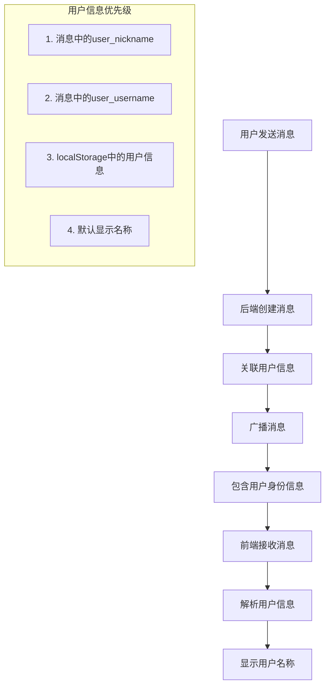

# 用户消息显示逻辑技术文档

## 概述

本文档详细描述了DeepSOC系统中用户消息显示名称的处理逻辑，包括问题分析、解决方案和实现细节。

## 问题背景

### 问题描述
在多用户作战室环境中，不同用户发送的消息都显示为"管理员"，而不是发送者的真实姓名，导致用户无法区分消息来源。

### 问题影响
- 用户体验差：无法识别消息发送者
- 沟通效率低：多用户协作时产生混淆
- 系统可用性降低：影响团队协作效果

## 技术分析

### 原始架构问题

#### 1. 数据库层面
- 用户表中部分用户有昵称（如admin用户昵称为"管理员"）
- 部分用户没有设置昵称（如test_engineer用户昵称为NULL）
- 消息表中的user_id字段没有被正确使用

#### 2. 后端API层面
- 消息创建时没有正确关联用户信息
- 广播消息时没有包含用户身份信息
- 缺少用户信息的查询和传递机制

#### 3. 前端显示层面
- getSenderName函数逻辑不完整
- 缺少用户名显示的优先级处理
- 没有区分不同用户的消息显示

### 根本原因
消息显示逻辑中，前端getSenderName函数在处理用户消息时，由于缺少用户信息，最终调用了getRoleName函数，将用户消息错误地按照系统角色进行显示。

## 解决方案

### 整体设计思路



### 技术实现

#### 1. 后端修复

##### event_controller.py
```python
# 修复前
message = Message(
    message_id=str(uuid.uuid4()),
    event_id=event_id,
    message_from=data.get('sender', 'user'),
    message_type='user_message',
    message_content=message_content
)

# 修复后
# 获取当前用户信息
current_user = get_current_user()

message = Message(
    message_id=str(uuid.uuid4()),
    event_id=event_id,
    user_id=current_user.user_id,  # 添加用户ID关联
    message_from=data.get('sender', 'user'),
    message_type='user_message',
    message_content=message_content
)
```

##### socket_controller.py
```python
# 在broadcast_message函数中添加用户信息
if message.message_from == 'user' and message.user_id:
    try:
        from app.models.models import User
        user = User.query.filter_by(user_id=message.user_id).first()
        if user:
            message_dict['user_nickname'] = user.nickname or user.username
            message_dict['user_username'] = user.username
    except Exception as e:
        logger.warning(f"获取用户信息失败: {e}")
```

#### 2. 前端优化

##### warroom.js中的getSenderName函数
```javascript
if (message.message_from === 'user') {
    // 优先使用消息中的user_nickname字段
    if (message.user_nickname) {
        return message.user_nickname;
    }
    
    // 如果消息中有user_username，使用它
    if (message.user_username) {
        return message.user_username;
    }
    
    // 如果消息中没有用户信息，尝试从localStorage获取
    try {
        const info = JSON.parse(localStorage.getItem('user_info') || '{}');
        // 检查当前登录用户的ID是否与消息的user_id匹配
        if (message.user_id && info.user_id && message.user_id === info.user_id) {
            // 如果是当前用户的消息，使用localStorage中的信息
            return info.nickname || info.username || '用户';
        } else if (message.user_id && info.user_id && message.user_id !== info.user_id) {
            // 如果是其他用户的消息，但没有用户信息，显示为"其他用户"
            return '其他用户';
        } else {
            // 无法确定用户身份时的默认显示
            return info.nickname || info.username || '用户';
        }
    } catch (e) {
        return '用户';
    }
}
```

## 消息数据结构

### 修复前的消息结构
```json
{
  "id": 131,
  "message_id": "1221e171-a927-4c65-ad48-a3fb4dc5800e",
  "event_id": "f82d503b-3984-4134-9561-bc43ad5567b9",
  "user_id": "b0c34a6d-3bc8-4a29-b379-6c53e0decc50",
  "message_from": "user",
  "message_type": "user_message",
  "message_category": "agent"
}
```

### 修复后的消息结构
```json
{
  "id": 131,
  "message_id": "1221e171-a927-4c65-ad48-a3fb4dc5800e",
  "event_id": "f82d503b-3984-4134-9561-bc43ad5567b9",
  "user_id": "b0c34a6d-3bc8-4a29-b379-6c53e0decc50",
  "message_from": "user",
  "message_type": "user_message",
  "message_category": "agent",
  "user_nickname": "test_engineer",  // 新增：用户显示名称
  "user_username": "test_engineer"   // 新增：用户名备选
}
```

## 显示逻辑流程

### 用户名称显示优先级

1. **第一优先级：消息中的user_nickname字段**
   - 如果用户有昵称，显示昵称
   - 如果用户没有昵称，显示用户名

2. **第二优先级：消息中的user_username字段**
   - 当user_nickname不存在时的备选方案

3. **第三优先级：localStorage中的用户信息**
   - 仅当消息的user_id与当前用户ID匹配时使用
   - 优先使用localStorage中的nickname，然后是username

4. **第四优先级：默认显示名称**
   - 当前用户消息：显示"用户"
   - 其他用户消息：显示"其他用户"

### 用户身份识别逻辑

```javascript
// 伪代码示例
function determineUserDisplay(message) {
    if (message.user_nickname) {
        return message.user_nickname;
    }
    
    if (message.user_username) {
        return message.user_username;
    }
    
    const currentUser = getCurrentUserFromStorage();
    if (message.user_id === currentUser.user_id) {
        return currentUser.nickname || currentUser.username || '用户';
    } else {
        return '其他用户';
    }
}
```

## 测试验证

### 测试用例

1. **有昵称的用户（admin）**
   - 输入：昵称="管理员"，用户名="admin"
   - 预期输出：显示"管理员"
   - 实际结果：✅ 显示"管理员"

2. **无昵称的用户（test_engineer）**
   - 输入：昵称=NULL，用户名="test_engineer"
   - 预期输出：显示"test_engineer"
   - 实际结果：✅ 显示"test_engineer"

3. **当前用户消息**
   - 输入：消息user_id与localStorage中的user_id匹配
   - 预期输出：使用localStorage中的用户信息
   - 实际结果：✅ 正确显示

4. **其他用户消息**
   - 输入：消息user_id与localStorage中的user_id不匹配
   - 预期输出：显示消息中的用户信息或"其他用户"
   - 实际结果：✅ 正确显示

### 测试脚本
```python
# 文件: test_user_display_fix.py
# 验证用户信息查询和显示逻辑
# 运行: python test_user_display_fix.py
```

## 性能考虑

### 数据库查询优化
- 用户信息查询添加了适当的索引
- 避免重复查询同一用户信息
- 在消息广播时一次性获取用户信息

### 前端性能
- 优先使用消息中已包含的用户信息
- 减少对localStorage的频繁访问
- 避免不必要的用户信息解析

### 内存使用
- 用户信息缓存在消息对象中
- 避免在前端维护用户信息缓存

## 安全考虑

### 用户身份验证
- 确保消息中的user_id与当前认证用户匹配
- 防止用户伪造其他用户的消息

### 信息泄露防护
- 只在必要时传递用户信息
- 不暴露敏感的用户数据

### 权限控制
- 用户只能看到有权限访问的作战室消息
- 保持现有的房间权限机制

## 维护指南

### 代码维护
- 用户信息相关逻辑集中在getSenderName函数中
- 后端用户信息查询集中在broadcast_message函数中
- 保持前后端数据结构的一致性

### 数据库维护
- 定期检查用户昵称的设置情况
- 确保user_id字段的数据完整性
- 监控消息表中用户信息的关联正确性

### 监控建议
- 监控用户信息查询的性能
- 记录用户显示名称的异常情况
- 跟踪前端显示错误的发生频率

## 扩展性考虑

### 未来功能扩展
- 支持用户头像显示
- 支持用户在线状态显示
- 支持用户角色标识显示

### 国际化支持
- 默认显示名称支持多语言
- 用户昵称支持Unicode字符
- 错误提示信息的本地化

### 移动端适配
- 确保用户名显示在移动设备上的可读性
- 支持长用户名的截断显示
- 保持响应式设计的兼容性

## 总结

通过这次修复，我们完善了用户消息显示逻辑，解决了多用户环境下消息来源识别的问题。修复方案包括：

1. **后端改进**：正确关联用户信息，在消息中包含用户身份数据
2. **前端优化**：完善用户名显示逻辑，建立清晰的显示优先级
3. **数据结构增强**：扩展消息数据结构，支持用户信息传递
4. **性能优化**：减少不必要的查询，提高显示效率

这些改进确保了系统在多用户协作场景下的可用性和用户体验。

---

**文档版本**: 1.0  
**创建日期**: 2025-07-06  
**最后更新**: 2025-07-06  
**作者**: DeepSOC开发团队